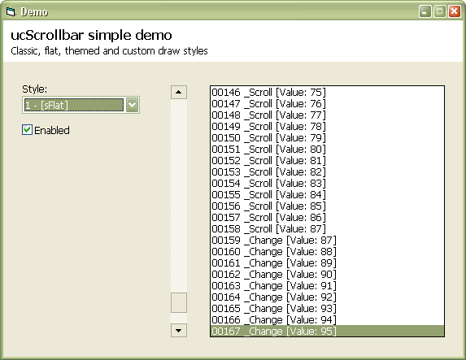



## ucScrollbar 1\.0 \(rv 4\)

### Description

Another little control. This time, a basic 'custom-draw' method is supported. // Last update: 12.20.05 (rv 4)
 
### More Info
 

             |
---                |---
**Submitted On**   |2005-10-27 17:47:48
**By**             |[Carles P\.V\.](https://github.com/Planet-Source-Code/PSCIndex/blob/master/ByAuthor/carles-p-v.md)
**Level**          |Intermediate
**User Rating**    |5.0 (60 globes from 12 users)
**Compatibility**  |VB 6\.0
**Category**       |[Custom Controls/ Forms/  Menus](https://github.com/Planet-Source-Code/PSCIndex/blob/master/ByCategory/custom-controls-forms-menus__1-4.md)
**World**          |[Visual Basic](https://github.com/Planet-Source-Code/PSCIndex/blob/master/ByWorld/visual-basic.md)
**Archive File**   |[ucScrollba19580312202005\.zip](https://github.com/Planet-Source-Code/carles-p-v-ucscrollbar-1-0-rv-4__1-63046/archive/master.zip)

